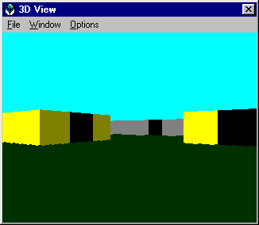

# VBRay

This is an extremely simple raycasting proof-of-concept. It borrows heavily from [Lodev's Raycasting tutorial](https://lodev.org/cgtutor/raycasting.html), but it uses GDI lines to draw the walls on a Windows form.

Uses WASD to move. Load the example world "Arcade.csv" from the File menu to start!

I've run it on a 486 DX-2 55 Mhz, but it was very slow. There are lower-resolution options for display if needed. There's also a minimap window which shows the path of the rays used for casting!

Sprite icons are 16 colors Windows 3.x format. In theory, they can be 32x32, but I've only tried with 16x16.

